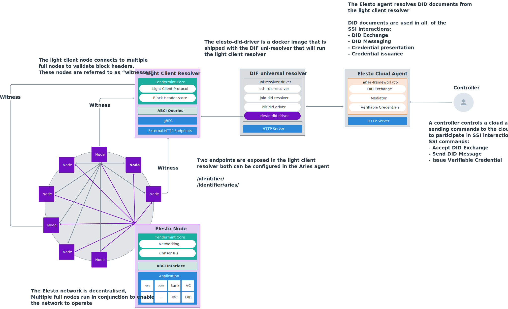

# ADR 004: Light Client resolver

## Changelog

- 2022-05-05: First Draft

## Status

PROPOSED - Not Implemented

## Abstract

DID resolution is the process of obtaining a DID document for a given DID and performs a Read operation. Read is one of four required operations (Read, Create, Update, and Deactivate) that can be performed on any DID. The details of these operations differ depending on the DID method. Building on top of DID resolution, DID URL dereferencing is the process of retrieving a representation of a resource for a given DID URL. The software, hardware, or both software and hardware that is able to execute these processes is called a DID resolver.

Resolvers are off-chain services that query blockchain data and are widely used for getting DID (Decentralized Identifier) documents from a VDR (Verifiable Data Registry). We need a resolver for the Elesto network that supplements the VDR application and provides the same guarantees about data security.

## Context

We want to integrate into the SSI ecosystem, one way to do this is by creating a DID resovler and integrating it into the DIF universal resolver. Most resolvers connect to a single node (`did:kilt`, `did:ethr`, `did:jolo`) this causes a problem of trust, now users of the resolver need to trust the data requested from the resolver is correct.

### Resolving a DID Document

This section defines an algorithm for DID resolution, based on the abstract functions `resolve()` and `resolveRepresentation()` as defined in section DID Resolution in [DID-CORE](https://www.w3.org/TR/did-core/#did-resolution):

```javascript
resolve ( did, resolutionOptions )
     -> ( didResolutionMetadata, didDocument, didDocumentMetadata )

resolveRepresentation ( did, resolutionOptions )
     -> ( didResolutionMetadata, didDocumentStream, didDocumentMetadata )
```

The resolve function returns the DID document in its abstract form (a map). The resolveRepresentation function returns a byte stream of the DID Document formatted in the corresponding representation.

### Resolver implementation

The resolvers will use a gRPC client based on the Cosmos SDK protobuffer implementation to connect to a full Elesto node to get data.

### Light client

To enable the resolver to have the same guarantees about its data as querying the blockchain directly, we leverage a light client protocol.

Light clients are assumed to be initialized once from a trusted source with a trusted header and validator set. The light client protocol allows a client to then securely update its trusted state by requesting and verifying a minimal set of data from a network of full nodes (at least one of which is correct).

### Data transformation on the resolver

Before returning data to the user, some data needs to be transformed. Data transformation is necessary due to some limitations with [protobuffers](https://developers.google.com/protocol-buffers).

- Rename "context" to "@context"
- Remove empty lists based on JSON-LD context
- Compute DID metadata

For [ephemeral DIDs](../ADR/adr-003-did.md), the resolver will generate the resolved document without interacting with the node.

### Endpoints

Two endpoints will be exposed with have the same functionality but will transform the DID document slightly, the Aries endpoint is specifically used by [aries-framework-go agents](https://github.com/hyperledger/aries-framework-go).

- `/1.0/identifier`
- `/1.0/identifier/aries`


[Sequence Diagram Resolution PUML](../../assets/diagrams/src/resolver_sequence.puml)

### Dereferencing

All conforming DID resolvers implement the following function which has the following abstract form:

```javascript
dereference(didUrl, dereferenceOptions) →
   « dereferencingMetadata, contentStream, contentMetadata »
```

### Architecture



## Decision

The scope of this work is two fold:

1. We will create a resolver, this resolver will query data and compute proofs that data is correct.
2. Then we will integrate the resolver into the DIF universal resolver.

### Resolver implementation

The resolver will package a Cosmos SDK gRPC client and a Tendermint light client into a golang binary.

### DIF universal resolver driver implementation

The universal resolver driver will be a Docker image that can be packaged into the DIF universal resovler.

## Consequences

The implementation of the resolver will take more time than implementing a single node GRPC resovler.

### Backwards Compatibility

N/A

### Positive

- Solves the issue with data security between resolver serivce and consuming applications defined in [Issue #13](https://github.com/w3c-ccg/did-resolution/issues/13).

### Negative

- Could complicate resolver deployment

### Neutral

- Utilizing Tendermint core advanced features

## Further Discussions

- Integration into DIF universal-resovler
- Exposing light client broadcast tx functionality by default

## Test Cases

- [W3C DID test suite](https://github.com/elesto-dao/did-test-suite)

## References

- https://w3c-ccg.github.io/did-resolution/
- https://github.com/w3c-ccg/did-resolution/issues/13
- https://medium.com/decentralized-identity/a-universal-resolver-for-self-sovereign-identifiers-48e6b4a5cc3c
- https://github.com/decentralized-identity/ethr-did-resolver
- https://github.com/jolocom/jolo-did-method/tree/master/packages/jolo-did-resolver
- https://github.com/KILTprotocol/kilt-did-driver
- https://eth.wiki/concepts/light-client-protocol
- https://docs.tendermint.com/master/tendermint-core/light-client.html
- https://developers.google.com/protocol-buffers
