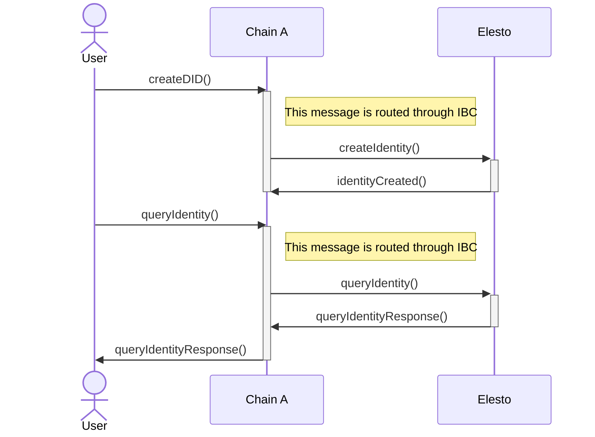
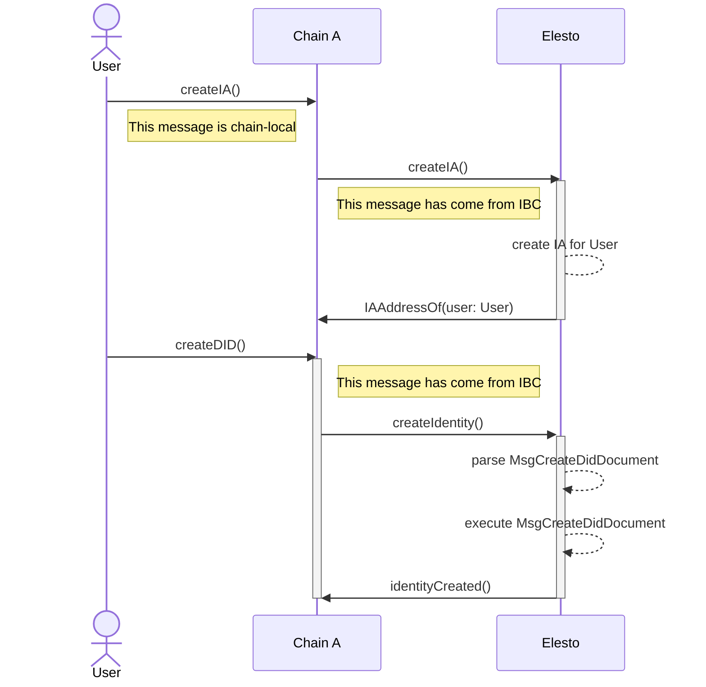

# ADR 005: IBC-enabled DIDs

## Changelog

- 2022-04-12: Initial draft

## Status

DRAFT

## Abstract

This document describes how Elesto decentralized identifiers behave in the context of the IBC protocol, with particular focus on how they tie in with the Interchain Accounts module.

## Context

In an IBC-enabled ecosystem like Cosmos, application-specific blockchain act as central points of connectivity for a well-defined set of functionalities.

One of the main functionality of Elesto is providing decentralized identities infrastructure - such as DIDs themselves and SSI-compatible resolvers - which can benefit from being operated and interacted with by means of the IBC protocol.

This document outlines how IBC-enabled DIDs can be implemented by leveraging infrastructures which already exist in the Cosmos ecosystem.

### General architecture

Elesto is the central point of storage for decentralized identifiers in the Cosmos ecosystem.

Instead of implementing the W3C DID specification from scratch, chain developers leverage the already-existing infrastructure in Elesto to archive and retrieve identities in a standard-compliant way.

Chain developers would just need to include a small library which will take care of setting up the whole communication architecture for them, reducing the "identity use-case" time-to-market factor to an almost insignificant value 

On top of that using Elesto as a unified archive for DIDs in the ecosystem would greatly promote usage of well-defined and adopted standards, pushing forward the decentralized identity use-cases and philosophy.

### Interchain Accounts

The Interchain Accounts (IA) standard defines an IBC-enabled way for different blockchains to create and authorize transactions among them, without the need for explicit cryptographic signatures on both sides.

A IA-enabled blockchain can either be:
 - **host**, where an IA is registered
 - **controller**, where IA registration is initiated and user can authorize transactions to be executed on a host

Since Elesto wants to provide DID registration and querying functionality to all IA-enabled chains out there, it will act as a **host**.

Controller chains create IA through IBC messages, after that the associated accounts are enabled to execute transactions on the host chain simply because the original transaction has been verified and committed on the controller's ledger: host chains limit themselves to keeping state and obeying whatever the IA module says.

### Interchain Accounts-enabled DIDs

To create a DID a user must broadcast a `MsgCreateDidDocument` message from an Interchain Account-enabled chain, which is wired to support Elesto's DID message types and part of its `protobuf` codec.

The process works as follows, assuming `Chain A` and `Elesto` have the basic IBC components in place:
 1. user broadcasts `register` transaction on `Chain A`
 2. various IBC protocol components will deliver the transaction to `Elesto`, which will process it and create an IA for the user on its local ledger - now user can query their own IA `Elesto` address by querying `Chain A`
 3. user broadcasts a `submitTx` transaction from `Chain A`, which contains a well-defined `MsgCreateDidDocument`
 4. IBC transports the message to `Elesto`, which will validate and eventually execute the message hence creating a DID for the user.

The user will be able to query their new DID by using any SSI resolver connected to the Elesto network.

Since spam prevention is embedded in both the IBC protocol and more generally in the Cosmos transactional model, there is no need to add a separate firewalling layer at the Elesto level.

## Decision

Given the drastically lower complexity Interchain Accounts bring, we will integrate a host component in Elesto instead of rolling our own IBC-enabled DID module.

We will also design an easy to use library which will allow users and developers to easily integrate into the Elesto identities ecosystem. 

## Consequences

Implementing IBC-enabled DIDs through Interchain Accounts is substantially less intensive in terms of developer and design hours, although there are some negative points to be taken into account.

### Backwards Compatibility

Since controller chains will need to embed a piece of the Elesto models in their own model schema, a clear and up-to-date upgrade path must be provided to them if/when the DID model changes.

### Positive

 - Solution is easy and quick to implement for both Elesto and controller chains
 - Many chains will benefit from being SSI-compatible with minimal effort
 - Most protocol-level moving parts are already audited and ready to be used
 - Elesto DID work towards distributed identities will benefit the entire ecosystem

### Negative

 - Since Interchain Accounts rely on IBC, there's risk of the protocol not scaling enough in high-traffic situations
 - IBC clients must be kept in sync to avoid expiration, which could potentially lead to DID being unavailable
 - The IBC protocol brings another layer of abstraction which potentially could makes debugging protocol problems hard

### Neutral

- IBC relayers are scarce, and they'll probably stay like that until proper incentivization is implemented
- Designing and maintaining a IA-enabled client library is not hard but it surely is tiresome

## Further Discussions

Right now the Elesto DID protocol does not have any form of extra fee payment for the creation of a DID, which should be taken into account before moving this spec from DRAFT to PROPOSED.

## References

- [Elesto DID specification](./adr-003-did.md)
- [Interchain Account specification](https://github.com/cosmos/ibc/blob/master/spec/app/ics-027-interchain-accounts/README.md)
-
