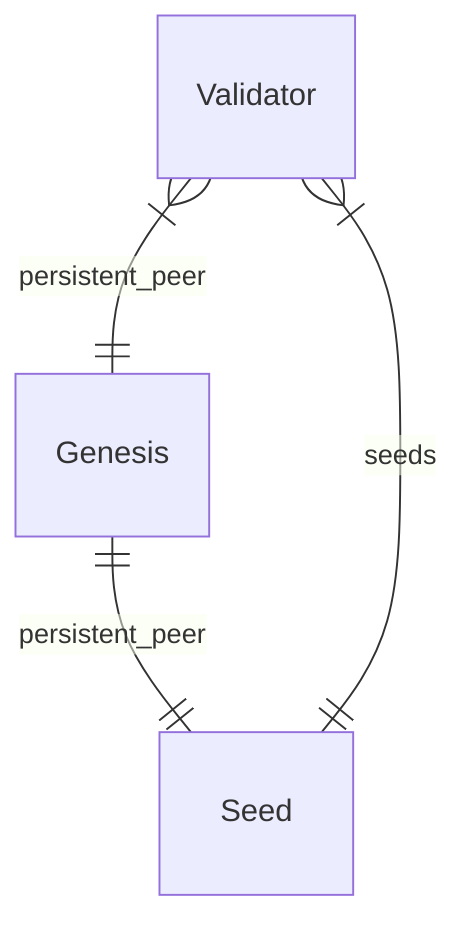

# Create a local blockchain on a Kubernetes cluster

## Using k3d

⚠️ While the elesto repository is private, 
GitHub credentials are required to access the GitHub Container Registry.
Copy the `registries.yaml.sample` into `registries.yaml`and replace username, password 
with an active and valid [GitHub Personal Access Token](https://docs.github.com/en/authentication/keeping-your-account-and-data-secure/creating-a-personal-access-token).

`make k3d-start k3d-deploy`

## Accessing a node

`make port-forward` or `kubectl port-forward --namespace local svc/genesis 26657`
Then `curl localhost:26657/validators | jq '.result.validators[].address'`

## Download the genesis file

`kubectl get configmap --namespace local genesis --output jsonpath='{.data.genesis\.json}' | jq`

## Entity relationship diagram

