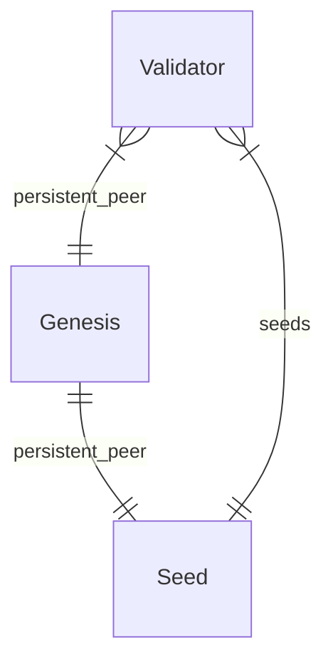

# Local blockchain on Kubernetes

## Using k3d

`make k3d-start k3d-deploy`

## Accessing a node

`make port-forward` or `kubectl port-forward --namespace local svc/genesis 26657`
Then `curl localhost:26657/validators | jq '.result.validators[].address'`

## ER Diagram

